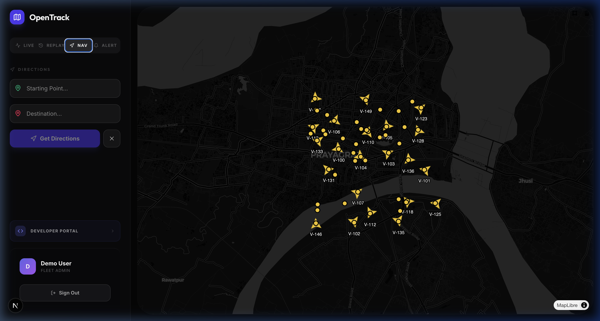
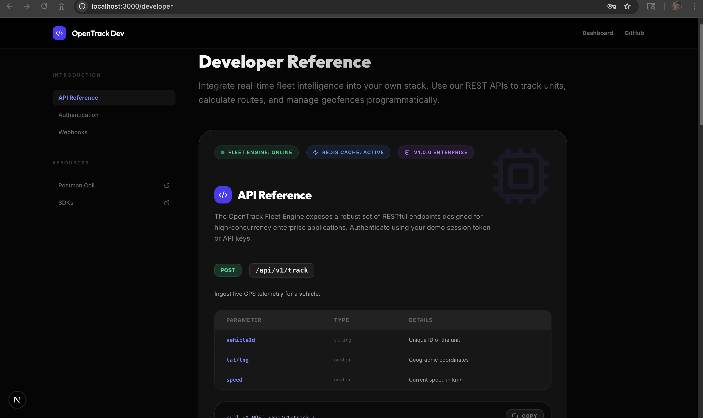
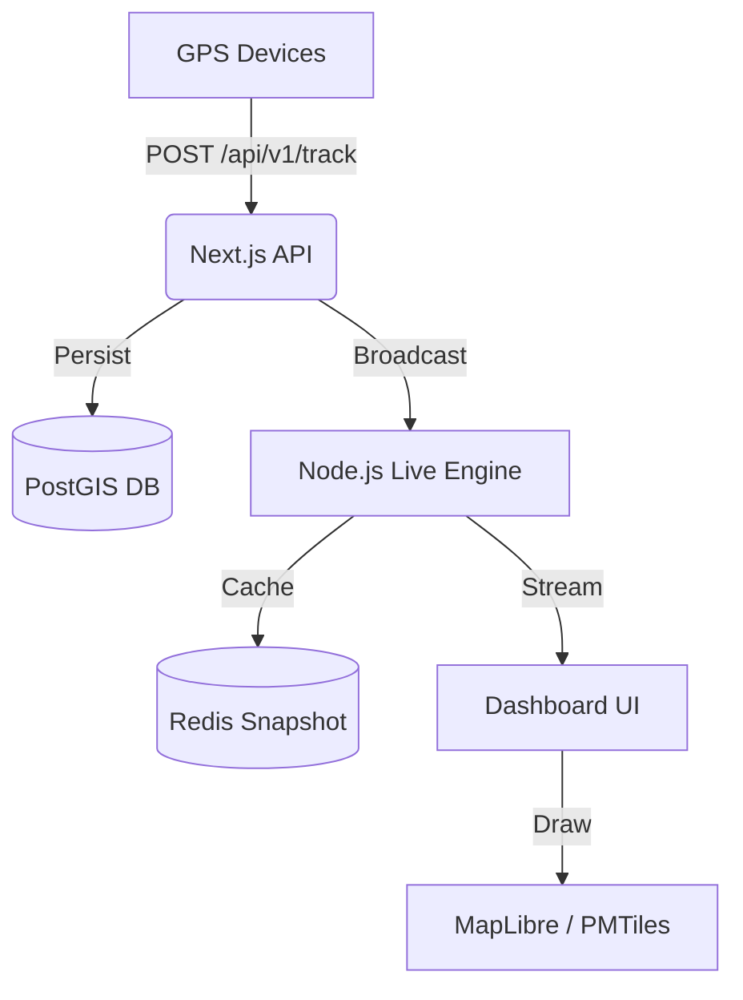

# 🗺️ OpenTrack: Enterprise Fleet Intelligence

[](https://nextjs.org)
[](https://maplibre.org)
[](https://redis.io)
[](https://postgis.net)

**OpenTrack** is a high-performance, open-source fleet management platform designed for the complex urban landscape of modern global logistics. Built with a focus on zero-latency tracking and developer-first extensibility, it transforms raw GPS telemetry into actionable business intelligence.

---

## 🖼️ Gallery

### Live Fleet Dashboard

*Real-time vehicle movement and high-density fleet telemetry.*

### API-First Developer Portal

*Built for integration: Live API documentation and service health monitoring.*

---

## 🚀 Key Features

### 📡 Real-time Telemetry (60 FPS)
Experience butter-smooth vehicle movement. Using advanced interpolation and MapLibre GL JS, markers glide across the map with zero stutter, even under high network latency.

### 🕰️ The Time Machine (Historical Replay)
Scrub through any vehicle's history with precision. Our high-speed PostGIS backend retrieves months of data in milliseconds, rendered with synchronized "Ghost Markers" for deep incident analysis.

### 🛡️ The Watchman (Geofencing)
Draw complex safety zones directly on the map. Our client-side spatial engine (Turf.js) detects entry/exit events instantly, triggering native browser notifications and external webhooks.

### 🔌 API-First Engine
A full-featured developer portal providing REST access to every core system:
*   **Routing**: OSRM-powered pathfinding.
*   **Analytics**: Daily distance and idle-time aggregation.
*   **Webhooks**: Real-time event streaming to your own backend.

---

## 🏗️ Architecture



---

## 🛠️ Quick Start (Production)

Deploy the entire stack in seconds using Docker:

```bash
docker-compose up --build
```

Access the ecosystem:
*   **Dashboard**: `http://localhost:3000/dashboard`
*   **Developer Portal**: `http://localhost:3000/developer`
*   **Live Engine**: `http://localhost:3001`

---

## 👨‍💻 Tech Stack
*   **Frontend**: Next.js 15, Tailwind CSS, MapLibre GL JS.
*   **Mapping**: Protomaps (PMTiles) for offline-capable, cost-free vector tiles.
*   **Backend**: Node.js, Prisma ORM, Socket.io.
*   **Data**: PostgreSQL + PostGIS (Geospatial), Redis (High-speed Cache).
*   **Analysis**: Turf.js (Spatial Analysis).

---

## 📜 Documentation
*   [API Reference](docs/api-guide.md)
*   [Geofencing Guide](docs/geofencing.md)
*   [Authentication](docs/authentication.md)
*   [Setup Maps](docs/setup-maps.md)

---

**Built with ❤️ for the future of logistics.**
