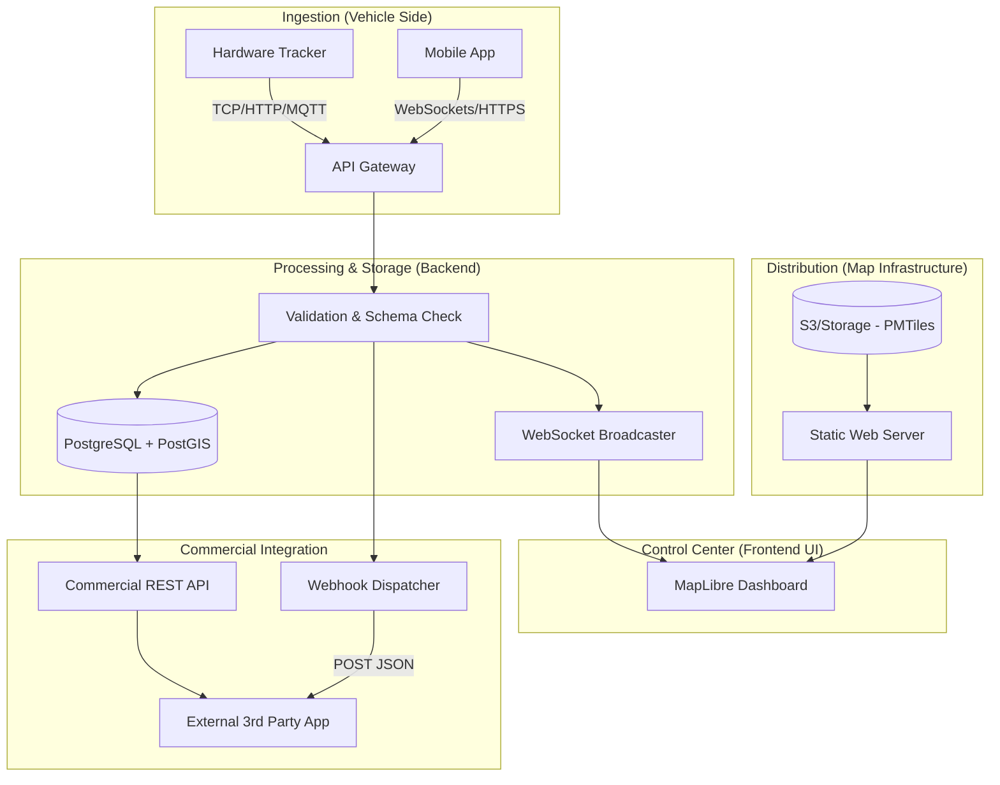

# OpenTrack Architecture 🏗️

This document outlines the high-level data flow and component design for the OpenTrack platform.

## 1. High-Level Data Flow

## 2. Component Details

### A. The "Map Layer" (Protomaps)
We deviate from traditional map stacks (like GeoServer or TileServer GL) by using **PMTiles**.
- **Storage**: Maps are stored as a single `.pmtiles` file.
- **Performance**: We use HTTP Range Requests to fetch hanya tiny portions of the file based on the user's viewport.
- **Scale**: Since the "map server" is just a static file, it is impossible to crash.

### B. The "Real-time Engine" (WebSockets)
To handle 100s of vehicles with passengers:
- **Broadcasting**: When a vehicle pings the server, the server broadcasts that state to all "watching" managers.
- **Interpolation**: The frontend doesn't just "move" the icon; it calculates a smooth path between the last two known points to ensure a fluid 60FPS experience.

### C. The "Geospatial Database" (PostGIS)
PostgreSQL handles the complex logic:
- **Point-in-Polygon**: Checking if a vehicle is inside a specific neighborhood or fenced area.
- **Distance Calculation**: Computing mileage by calculating the `ST_Distance` between consecutive GPS points.
- **Spatial Indexing**: Using GIST indexes to make searching for "all vehicles within 5km" incredibly fast.

### D. The "Commercial API"
Built with a "Developer First" mindset:
- **Rate Limiting**: To ensure stability for commercial users.
- **JSON Standard**: All geospatial data follows GeoJSON standards for easy integration with other GIS tools.

---

## 3. Data Schema (Core Tables)

### `vehicles`
| Column | Type | Description |
| :--- | :--- | :--- |
| `id` | UUID | Primary Key |
| `plate_number` | String | Unique identifier for the vehicle |
| `owner_id` | UUID | Commercial account mapping |
| `status` | Enum | `active`, `offline`, `maintenance` |

### `coordinates`
| Column | Type | Description |
| :--- | :--- | :--- |
| `id` | BigInt | Primary Key |
| `vehicle_id` | UUID | Reference to vehicle |
| `geom` | Geometry(Point, 4326) | The actual GPS coordinate |
| `speed` | Float | Captured speed in km/h |
| `passengers` | Int | Current passenger count |
| `created_at` | Timestamp | Server reception time |
